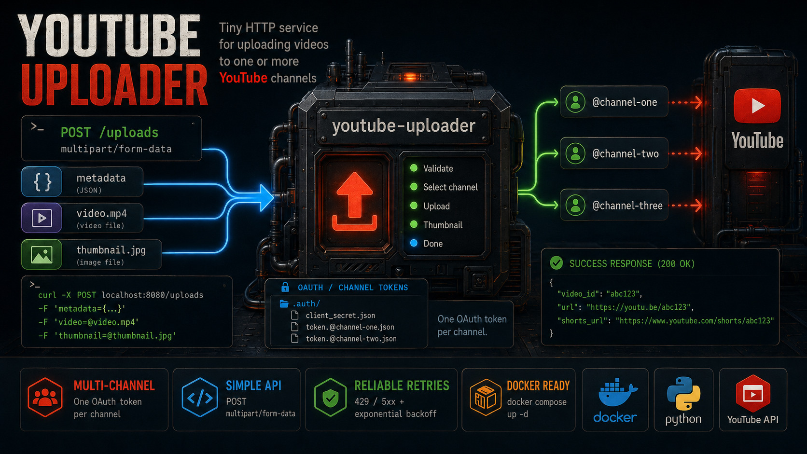

<!-- youtube-uploader README.md -->
# youtube-uploader



Small HTTP service for uploading videos to one or more YouTube channels.


## Run

Create a token for at least one channel as described below, then start the service:

```bash
docker compose up -d --build
```

The API listens on `http://localhost:8080`.

## Test

Build the Docker test stage and print the complete test and coverage log:

```console
docker build --target test --progress=plain .
```

## Channels

OAuth files are stored in `.auth/`, one file per YouTube channel:

```text
.auth/
  client_secret.json
  token.@first-channel.json
  token.@second-channel.json
```

The channel handle in an upload request selects the corresponding token file.

Check whether a channel is configured:

```bash
curl http://localhost:8080/channels/@first-channel
```

Successful response:

```json
{"handle":"@first-channel"}
```

## Upload

Send a `multipart/form-data` request to `POST /uploads` with:

| Field       | Required | Content                        |
| ----------- | -------- | ------------------------------ |
| `metadata`  | yes      | JSON object described below.   |
| `video`     | yes      | Video file.                    |
| `thumbnail` | no       | Thumbnail file, at most 2 MiB. |

Example:

```bash
curl -X POST http://localhost:8080/uploads \
  -F 'metadata={"channel":"@first-channel","title":"My video","description":"Uploaded by youtube-uploader","privacy":"unlisted"}' \
  -F 'video=@video.mp4' \
  -F 'thumbnail=@thumbnail.jpg'
```

Metadata fields:

| Field         | Required | Meaning                                                                    |
| ------------- | -------- | -------------------------------------------------------------------------- |
| `channel`     | yes      | YouTube handle beginning with `@`.                                         |
| `title`       | no       | Video title. Defaults to the uploaded filename without its extension.      |
| `description` | no       | Video description. Defaults to an empty string.                            |
| `privacy`     | yes      | `private`, `unlisted`, or `public`.                                        |
| `publish_at`  | no       | UTC time such as `2026-05-10T08:00:00Z`; scheduled uploads become private. |

Successful response:

```json
{
  "video_id": "abc123",
  "url": "https://youtu.be/abc123",
  "shorts_url": "https://www.youtube.com/shorts/abc123"
}
```

Errors use a JSON body with an `error` code and a human-readable `message`.

## Retry behavior

YouTube requests retry temporary transport errors and HTTP `429`, `500`, `502`, `503`, and `504` responses. Configure retries with:

```env
MAX_UPLOAD_ATTEMPTS=5
RETRY_BASE_SECONDS=1
RETRY_MAX_SECONDS=30
```

Backoff uses exponential growth with random jitter.

The maximum accepted video size defaults to 10 GiB and can be configured in bytes:

```env
MAX_VIDEO_BYTES=10737418240
```

## Auth

### Creating `token.@channel.json`

After `client_secret.json` is ready, run:

```sh
docker run --rm -it -e PORT=4444 -p "4444:4444" -v "./.auth:/.auth" ghcr.io/tupinumboor/youtube-uploader oauth
```

Authorize in the browser. The script detects the authorized channel handle and creates the matching token file in `.auth/`.

## Getting `client_secret.json`

* Create a new Google Cloud Console project.
  [https://console.cloud.google.com/projectcreate](https://console.cloud.google.com/projectcreate)

* Enable **YouTube Data API v3**
  [https://console.cloud.google.com/apis/library/youtube.googleapis.com](https://console.cloud.google.com/apis/library/youtube.googleapis.com)

* Configure **OAuth consent screen**
  [https://console.cloud.google.com/auth/branding](https://console.cloud.google.com/auth/branding)

* Create OAuth credentials
  [https://console.cloud.google.com/apis/credentials](https://console.cloud.google.com/apis/credentials)

  * Click **Create Credentials**
  * Choose **OAuth client ID**
  * Application type: **Desktop app**
  * Click **Create**
  * Click **Download JSON**

* Save file as:

```text
.auth/client_secret.json
```

* Configure **Data Access**
  [https://console.cloud.google.com/auth/scopes](https://console.cloud.google.com/auth/scopes)

  * Click **Add or Remove Scopes**
  * User type: **External**
  * Publishing status: **Testing**
  * Add scopes:

```text
https://www.googleapis.com/auth/youtube.upload
https://www.googleapis.com/auth/youtube.readonly
```

* Add yourself as a test user
  [https://console.cloud.google.com/auth/audience](https://console.cloud.google.com/auth/audience)

### Release

Git tag:

```bash
git tag 1.0.0
git push origin 1.0.0
```

Published images:

```text
ghcr.io/tupinumboor/youtube-uploader:1.0.0
ghcr.io/tupinumboor/youtube-uploader:latest
```
